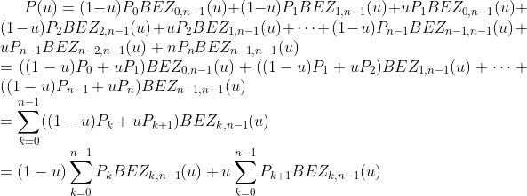
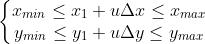
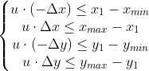

# 《计算机图形学》4月报告

学号：**171860004**  姓名： **戴若石**  邮箱：**2062499982@qq.com**

## 1 实验内容

实验要求是使用Python3语言完成一个绘图系统，能够绘制多种图形并对图形进行编辑。

截至提交完成了绘制线段、绘制多边形、绘制椭圆、图元平移、旋转、缩放、绘制曲线、对线段裁剪的算法部分、命令行界面部分以及用户交互界面部分。

还需完成重置画布、保存画布和设置画笔颜色的用户交互界面部分。

## 2 算法介绍

对于绘制算法，凭借算法输入可以确定需要显示的图元的数学方程式。算法所需要完成的是输出离这个方程式距离最近的整数点集。

对于编辑算法，输入为待编辑的图元编号和图元控制点坐标，对这些坐标进行相应变换以得到最终结果。

### 2.1 绘制线段

两点确定一条直线，算法输入为两个端点的坐标$(x_0, y_0), (x_1, y_1)$。

绘制线段的两个算法都是选取x或y方向为取样方向，以最小单位1为增量的取值，依次算出取样位置对应的点的坐标。

取增长更快的方向为取样方向（即斜率的绝对值小于1时取x方向， 斜率的绝对值大于1时取y方向），这样可以保证画出来的线段的连贯性。

#### 2.1.1 DDA（数值差分分析）算法

通过输入的两个端点坐标可以确定直线的斜率$m=\frac{y_1-y_0}{x_1-x_0}$，因此可以根据取样方向的增量算出另一方向对应的增量值。

以斜率小于1为例，此时取x方向为取样方向，$x_{k+1}=x_k+1$，从k=0开始依次计算$y_{k+1}:y_{k+1}=int(y_k+m)$，其中int()代表取整。

#### 2.1.2 Bresenham算法

由于取增长更快的方向为取样方向，那么非取样方向的增长一定慢于取样方向。取样方向的增量为1，也就是说非取样方向要么没有增长，要么增长为1。也就是说当$(x_k,y_k)$已经确定了，那只需要判断$(x_{k+1},y_k)$和$(x_{k+1},y_k+1)$哪个点离直线更加接近即可确定$y_{k+1}$的值。

由于只需要判断哪个离得更近，所以不需要计算出距离，只需要计算出与距离的差值符号相同的决策参数。

Bresenham算法流程如下：

决策参数初始化为$p_0=2\Delta y-\Delta x$。

从k=0开始依次确定$y_{k+1}$值并更新决策参数如下：

- 当$p_k<0$时，$y_{k+1}=y_k$，$p_{k+1}=p_k+2\Delta y$
- 当$p_k>0$时，$y_{k+1}=y_k+1$，$p_{k+1}=p_k+2\Delta y-2\Delta x$

#### 2.1.3 算法比较

CG_demo中给出了一个Naive算法是直接以x方向为取样方向，依次按照直线方程计算对应的y值。

- DDA算法与Naive算法相比，优点是在斜率很大时不会出现画出来的是不连贯的点集而非线段的问题，且计算过程中采用累加而非浮点数与整数相乘，性能更好。

  下图中左边为DDA所画，右边为Naive所画。

  

- DDA算法与Bresenham算法相比，缺点是计算斜率时会有误差，且在之后的累加过程中误差会积累得越来越大。

### 2.2 绘制多边形

绘制多边形的输入是顶点集。只需要依次调用对应的绘制线段算法将多变形的边依次画出即可。

### 2.3 绘制椭圆（中点圆生成算法）

绘制椭圆的输入是椭圆举行包围框的左上角和右下角顶点坐标，根据这两个坐标可以确定椭圆的中心点、长轴长和短轴长。

由于椭圆的对称性质，只需要确定第一象限的四分之一椭圆轨迹即可得到整个椭圆。

绘制椭圆的算法的核心思想与Bresenham绘制线段算法一样，都是计算决策参数以确定非取样方向的增量。

将四分之一椭圆轨迹根据切线斜率的绝对值与1的关系分成两个部分，防止出现椭圆轨迹不连贯的现象。

设椭圆中心为$(x_c, y_c)$，椭圆x方向轴长为$r_x$，椭圆y方向轴长为$r_y$。绘制椭圆算法流程如下：

令$(x_0,y_0)$为$(0,r_y)$，初始化决策参数为$p_0=r_y^2-r_x^2r_y+r_x^2/4$

从$k=0$开始循环测试，循环到$2r_y^2x\ge 2r_x^2y$，这部分$x_{k+1}=x_k+1$:

- 当$p_k<0$时，$y_{k+1}=y_k$，$p_{k+1}=p_k+2r_y^2x_{k+1}+r_y^2$
- 当$p_k>0$时，$y_{k+1}=y_k-1$，$p_{k+1}=p_k+2r_y^2x_{k+1}-2r_x^2y_{k+1}+r_y^2$

根据第一个部分最后的点$(x_1,y_1)$计算第二个部分的决策参数初始值为$p_0=r_y^2(x_1+1/2)^2+r_x^2(r_y-1)^2-r_x^2r_y^2$

从k=0开始循环测试，循环到$y\le 0$，这部分$y_{k+1}=y_k-1$：

- 当$p_k>0$时，$x_{k+1}=x_k$，$p_{k+1}=p_k-2r_x^2y_{k+1}+r_x^2$
- 当$p_k<0$时，$x_{k+1}=x_k + 1$，$p_{k+1}=p_k+2r_y^2x_{k+1}-2r_x^2y_{k+1}+r_x^2$

每一个点$(x_k,y_k)$在确定后都向结果点集中加入四个点：$(x_c+x_k,y_c+y_k),(x_c+x_k,y_c-y_k),(x_c-x_k,y_c+y_k),(x_c-x_k,y_c-y_k)$

### 2.4 绘制曲线

曲线绘制可以绘制两种不同的曲线：Bezier曲线和B-spline曲线。

#### 2.4.1 Bezier曲线

- 曲线介绍：

核心思想：曲线可用参数形式表示，对参数进行离散化取值以得到曲线上的点。

Bezier曲线的参数定义为：$$P(u)=\sum_{k=0}^nP_kBEZ_{k,n}(u)$$

其中$n+1$为控制点个数，$P_k$为第k个控制点坐标，$BEZ_{k,n}(u)$是Bernstein基函数，定义如下：$BEZ_{i,n}(u)=C(n,i)u^i(1-u)^{n-i}$

$BEZ_{k,n}(u)$有降阶公式如下：

$BEZ_{k,n}(u)=(1-u)BEZ_{k,n-1}(u)+uBEZ_{k-1,n-1}(u)$

且$BEZ_{0,n}=(1-u)BEZ_{0,n-1},BEZ_{n,n}=uBEZ_{n-1,n-1}$

带入参数定义展开得：

根据以上式子，可以写出$P(u)=P_0^n$的递归生成式如下：

当$r=0$时，$P_i^r=P_i$（$P_i$为第i个控制点）。

当r > 0时，$P_i^r=(1-u)P_i^{r-1}+uP_{i+1}^{r-1}$，其中$i=0,1,2,\cdots,n-r$，$r=1,2,\cdots,n$。

- 实现方式

由于上述递归生成式较简单，故而使用循环完成，最外层对$u$进行循环，接着对$r$进行循环，接着对$i$进行循环。$r$循环层内需记录上一次循环的结果用于下一次循环的生成。

对于u的离散化取值暂时取定制，步长为1/10000，这种写法在控制点很多的情况下速度很慢，可以对Bezier曲线进行逼近处理加速生成，不过暂时还未实现。

#### 2.4.2 B-spline曲线

- 曲线介绍：

B-spline曲线是对Bezier曲线的一般化推广。核心思想是把参数区间分成很多小区间，每一段连续的小区间分别构成曲线的一部分。

$n+1$个控制点生成的$k+1$阶（$k$次）B-spline曲线的定义如下：

$P(u)=\sum_{i=0}^nP_iN_{i,k+1}(u)\qquad u\in [u_k, u_{n+1})$

其中$N_{i,k+1}(u)$是B样条的基函数，是一个非递减的参数为u的$k+1$阶分段多项式，定义如下：

当$k=0$时，如果$u\in[t_i,t_{i+1})$，$N_{i,0}(u)=1$，否则$N_{i,0}(u)=0$。

当$k>1$时，$N_{i,k+1}(u)=\frac{u-u_i}{u_{i+k}-u_i}B_{i,k}(u)+\frac{u_{i+k+1}-u}{u_{i+k+1}-u_{i+1}}B_{i+1,k}(u)$。

- 实现方式：

需要实现的算法是三次均匀B样条曲线，即$k=3$且对参数区间均匀划分。

B样条基函数的计算通过写了一个递归调用的函数实现。对参数u进行一次取值按照B-spline曲线的定义计算曲线上点的坐标。

#### 2.4.3 对比

- 曲线样式不同：Bezier曲线的端点即为首末控制点，B-spline曲线不通过首末控制点。由于这个区别，在实现GUI的绘制曲线部分时，绘制两种不同的曲线，选取控制点的方式和顺序也不一样。
- 曲线性质不同：调整单个控制点的位置时，整个Bezier曲线都会受其影响，因为曲线上的每个点都与每个控制点相关；而B-spline曲线只有部分段会受其影响。即，对曲线的部分调整B-spline更方便。

### 2.5 图元平移、旋转和缩放

核心思想是对图元的输入点列表进行平移旋转和缩放，例如线段就是对于线段两端点进行对应操作。这样最后得到的图元就会整体进行平移旋转和缩放。

由于绘制椭圆只实现了对于长轴平行或垂直于x轴的椭圆的绘制，故而椭圆无法进行任意角度的旋转，只能旋转90°的倍数。用户交互界面中椭圆无法旋转。

旋转的实现思路是将平面直角坐标系转换为极坐标系，旋转完成之后再将极坐标系中的点映射到平面直角坐标系中就能得到结果。为此实现了一个函数cal\_r，输入平面直角坐标，输出将这个坐标映射到极坐标系后得到的极坐标中的角度。

### 2.6 对线段裁剪

输入线段的两个端点坐标，输出裁剪窗口内的线段的端点坐标。

对线段裁剪有两个算法：Cohen-Sutherland算法和Liang-Barsky算法。

#### 2.6.1 Cohen-Sutherland算法

核心思想：通过编码测试来减少需要计算交点的次数。

首先对于线段的两个端点，将端点坐标与裁剪窗口的四个边界进行比较得到每一位的编码，再通过编码的计算比较筛出完全在窗口内不需要裁剪，和部分完全在窗口外的情况。

接下来依次计算窗口的四个边界与线段所在直线的交点，并进行判断和修改线段端点坐标，最终得到裁剪结果。

#### 2.6.2 Liang-Barsky算法

核心思想：从参数方程的角度考虑线段。

端点坐标为$(x_1,y_1),(x_2,y_2)$的线段的参数方程为：

$x=x_1+u(x_2-x_1)$

$y=y_1+u(y_2-y_1)$

其中，$u\in[0,1]$。令$\Delta x = x_2-x_1,\Delta y=y_2-y_1$。

用左上角坐标为$(x_{min}, y_{min})$，右下角坐标为$(x_{max}, y_{max})$的裁剪窗口去裁剪这个线段即需要求出参数区间，使得区间内的参数$u$满足如下不等式：

可将其拆成四个不等式如下：

令$p_1=-\Delta x,p_2=\Delta x, p_3=-\Delta y,p_4=\Delta y $，$q_1=x_1-x_{min},q_2=x_{max} - x_1,q_3= y_1-y_{min},q_4=y_{max} - y_1$。

则上述不等式组可简化为：$u\cdot p_k\le q_k,(k=1,2,3,4)$。

$k=1,2,3,4$分别对应了左、右、下、上四条边界。

当$p_k=0$时说明线段与对应边界平行，此时需要特殊处理。

当$p_k<0$时说明对于对应边界，线段方向是从窗口外指向窗口内，即对应边界是一条入边边界；同理，当$p_k>0$时说明对应边界是一条出边边界。

$u=\frac{q_k}{p_k}$是对应边界与线段交点的参数值，想要求出裁剪后的线段的端点，即需要在0和两条入边与线段的交点中选取一个最大的参数值$u_1$，在1和两条出边与线段的交点中选取一个最小的参数值$u_2$，再根据这两个参数值求出端点坐标：

$(x_1+u_1\cdot\Delta x, y_1+u_1\cdot\Delta y),(x_1+u_2\cdot\Delta x, y_1+u_2\cdot\Delta y)$。

#### 2.6.3 算法比较

相比Liang-Barsky算法，Cohen-Sutherland算法虽然也对一些情况进行了筛选，但是还是过于繁琐，需要考虑的情况太多了，写代码的时候也很容易出错。

而Liang-Barsky算法通过数学参数化的方法，将裁剪窗口的四条边归于同一类，可以进行统一处理，即精简了代码，也使得代码的可读性更高。

## 3 系统介绍

直接使用了CG_demo提供的系统架构及交互逻辑。

### 3.1 命令行界面程序

对于合法的指令可以得到对应的输出。

item_dict字典中存储着需要绘制的图元的编号，定位坐标，以及对应的算法。

- 对于绘制指令，程序新建图元存储到字典中。

- 对于编辑指令，程序对字典中已经存在的图元的定位坐标进行更新。

- 对于保存画布指令，程序遍历字典，依次将画布上对应点设置为对应的颜色，最后保存到output文件夹下。

### 3.2 用户交互界面程序

运行后，界面左边部分为画布，右边部分为图元编号。

#### 3.2.1 文件

还未实现。

#### 3.2.2 绘制

选择绘制，对应可选择线段、多边形、椭圆和曲线。

- 线段：对应可选择Naive、DDA和Bresenham。

  鼠标在画布中点击、移动、松开，可得到一条以点击位置和松开位置为两个端点的线段，且移动过程中屏幕上始终显示以点击位置和当前鼠标位置为两个端点的线段。

- 多边形：对应可选择DDA和Bresenham。

  - 鼠标在画布中点击、移动、松开，得到以点击位置和松开位置为两个端点的第一条边。
  - 继续点击、移动、松开，得到以第一次松开位置和第二次松开位置为两个端点的第二条边，此时以第二次松开位置和第一次点击位置为两个端点的边也会显示（这时候可以看见一个三角形）。
  - 继续点击、移动、松开，得到以第二次松开位置和第三次松开位置为两个端点的第三条边，此时以第三次松开位置和第一次点击位置为两个端点的边也会显示（这时候可以看见一个四边形）。
  - 以此类推。
  - 结束绘制方式：双击或点击第一次点击位置附近（横向距离和纵向距离均小于10个像素点）。

- 椭圆

  鼠标在画布中点击、移动、松开，可得到一个以点击位置和松开位置为椭圆矩形包围框的左上角和右下角顶点坐标的椭圆。

- 曲线：对应可选择Bezier和B-spline，两者的绘制方法和结果都不一样

  - Bezier曲线：首先选择首末控制点，再依次选取中间控制点，具体如下：
  
    首先点击、移动、松开，得到一条端点为首末控制点的线段。再依次点击中间控制点，此时不松开鼠标并移动可修改这个控制点的位置以及得到的曲线，每次会得到已有控制点生成的曲线。双击结束绘制。
  
  - B-spline曲线：依次选取控制点，具体如下：
  
    依次点击选取控制点。由于三次B-spline曲线至少需要四个控制点，故控制点个数小于4时不会显示任何绘制点。当控制点个数达到4时，每次点击都会显示新的控制点集生成的曲线。双击结束绘制。

#### 3.2.3 编辑

选择编辑，对应可选择平移、旋转、缩放和裁剪。

- 平移：需首先选中图元，再点击平移，再在画布中点击移动。

  平移向量为从点击位置到松开位置的向量。

- 旋转：需首先选中图元，再点击旋转。

  旋转中心为图形的矩形包围框的中心，旋转角度为点击位置与中心的连线和松开位置与中心的连线的夹角角度。

- 缩放：需首先选中图元，再点击缩放。

  缩放倍数为松开位置与中心连线的长度除以点击位置与中心连线的长度。

- 对线段裁剪：需首先选中图元，再点击裁剪。

  裁剪窗口为以点击位置和松开位置为对角顶点的与x轴y轴平行的矩形。

  若线段不在裁剪窗口内，则该线段不再显示，线段id依旧存在，但是不能进行选择和相应操作。

## 4 总结

实现一个绘图系统可以帮助我们增强对设备及图形绘制算法的理解和对于图形输出原理的理解。

#### 参考资料

课程ppt: CG-03-Primitives、CG-05-Trimming、CG-06-Curve and Surface

菜鸟教程（python语言参考） https://www.runoob.com/python/python-tutorial.html 

B-spline曲线参考 https://zhuanlan.zhihu.com/p/50450278 