# 绘图系统使用说明书

学号：**171860004**  姓名： **戴若石**  邮箱：**2062499982@qq.com**

## 1 总体说明

此绘图系统包括命令行界面程序和用户交互界面程序。

命令行界面程序用如下指令运行：

```
python cg_cli.py input_path output_dir
```

其中input_path是输入文件路径，输入文件的指令格式与实验要求中的格式一样，就不赘述了。output_dir是输出文件夹的路径，保存画布得到的位图存在这个文件夹中。

用户交互界面程序用如下指令运行：

```
python cg_gui.py
```

此时会跳出一个名为CG 171860004的界面，如下图。

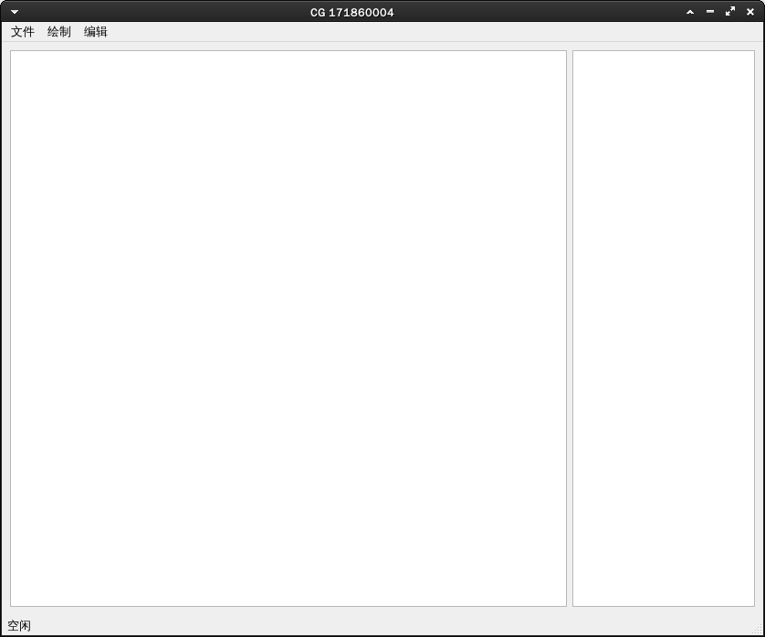


## 2 用户交互界面程序使用说明

运行后，界面左边部分为画布，右边部分为图元编号。

### 2.1 绘制

选择绘制，对应可选择线段、多边形、椭圆和曲线。

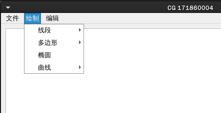

- 线段：对应可选择Naive、DDA和Bresenham。

  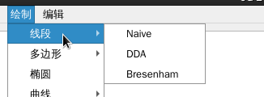

  鼠标在画布中点击、移动、松开，可得到一条以点击位置和松开位置为两个端点的线段，且移动过程中屏幕上始终显示以点击位置和当前鼠标位置为两个端点的线段。

  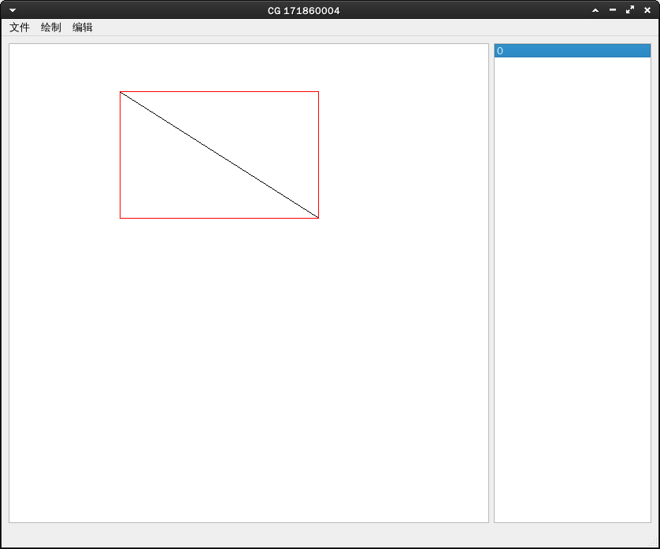

- 多边形：对应可选择DDA和Bresenham。

  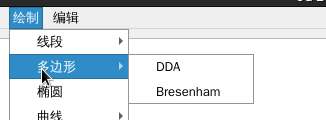

  - 鼠标在画布中点击、移动、松开，得到以点击位置和松开位置为两个端点的第一条边。
  - 继续点击、移动、松开，得到以第一次松开位置和第二次松开位置为两个端点的第二条边，此时以第二次松开位置和第一次点击位置为两个端点的边也会显示（这时候可以看见一个三角形）。
  - 继续点击、移动、松开，得到以第二次松开位置和第三次松开位置为两个端点的第三条边，此时以第三次松开位置和第一次点击位置为两个端点的边也会显示（这时候可以看见一个四边形）。
  - 以此类推。
  - 结束绘制方式：双击或点击第一次点击位置附近（横向距离和纵向距离均小于10个像素点）。

  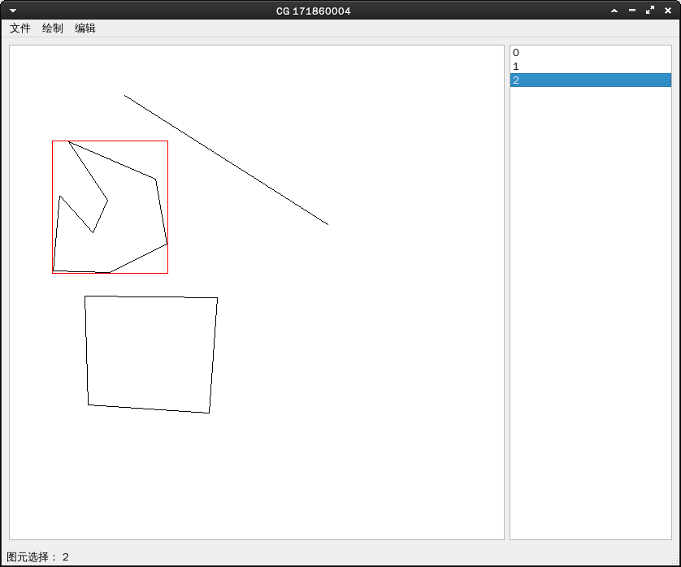

- 椭圆

  鼠标在画布中点击、移动、松开，可得到一个以点击位置和松开位置为椭圆矩形包围框的左上角和右下角顶点坐标的椭圆。

  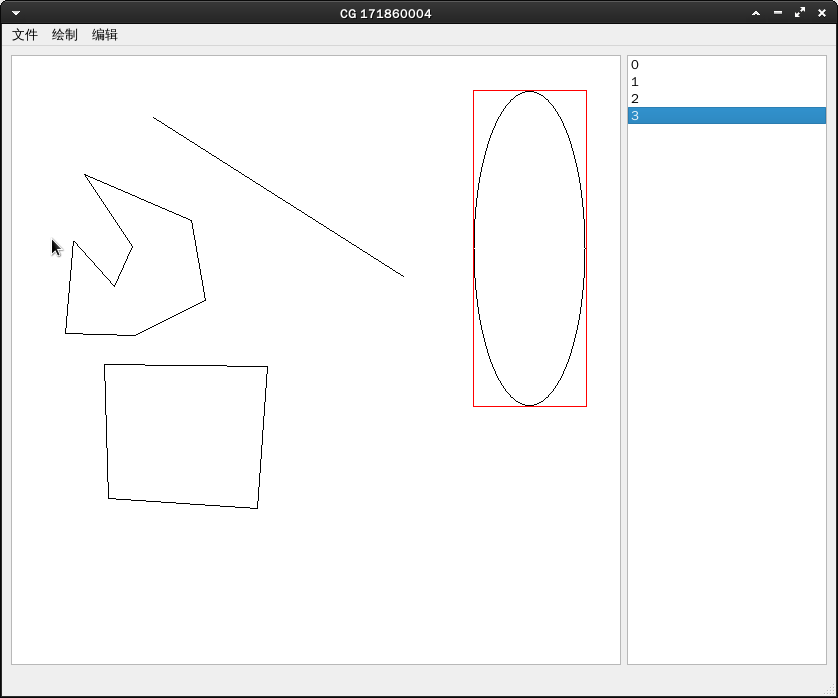

- 曲线：对应可选择Bezier和B-spline，两者的绘制方法一样，但是结果并不一样

  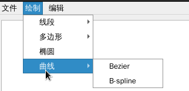

  - 二者的绘制方法：依次选取控制点。

  - 二者的结果：

    - Bezier曲线：由于至少需要三个控制点，故在选取到第三个控制点的时候会出现曲线，且曲线经过首末控制点。

      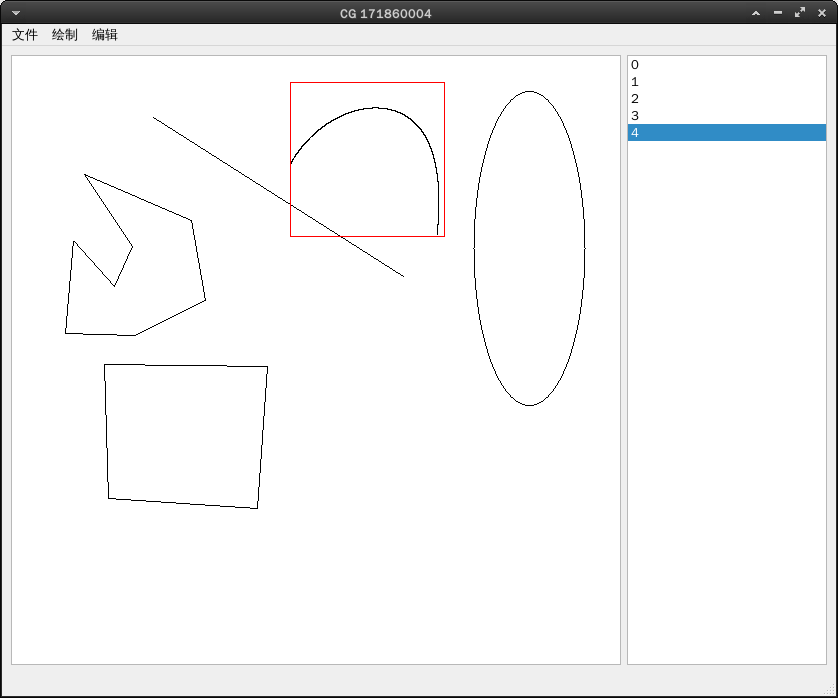

    - B-spline曲线：由于至少需要四个控制点，故在选取到第四个控制点的时候会出现曲线，且曲线不经过首末控制点。

      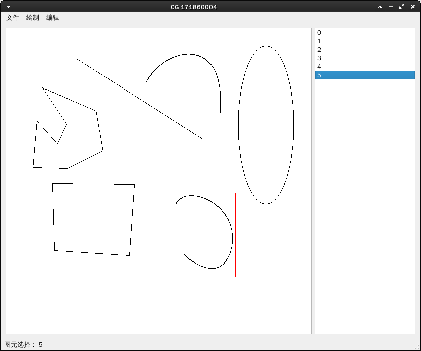

### 2.2 编辑

选择编辑，对应可选择平移、旋转、缩放和裁剪。

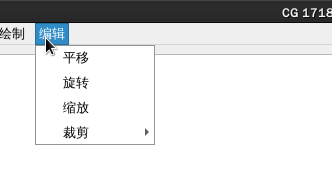

- 平移：需首先选中图元，再点击平移，再在画布中点击移动。

  平移向量为从点击位置到松开位置的向量。

- 旋转：需首先选中图元，再点击旋转。

  旋转中心为图形的矩形包围框的中心，旋转角度为点击位置与中心的连线和松开位置与中心的连线的夹角角度。

  注：椭圆无法旋转。

- 缩放：需首先选中图元，再点击缩放。

  缩放倍数为松开位置与中心连线的长度除以点击位置与中心连线的长度。

- 对线段裁剪：需首先选中图元，再点击裁剪。

  裁剪窗口为以点击位置和松开位置为对角顶点的与x轴y轴平行的矩形。

  若线段不在裁剪窗口内，则该线段不再显示，线段id依旧存在，但是不能进行选择和相应操作。

注：编辑部分的展示截图无法展现清楚，在视频中进行动态演示。

### 2.3 文件

选择编辑，对应可选择设置画笔、重置画布、保存画布和退出。

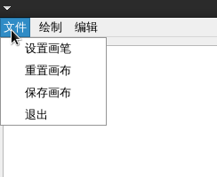

- 设置画笔：

  点击设置画笔，会连续跳出三个对话框要求你输入想要颜色rgb格式各自对应的数字。

  以RED为例：

  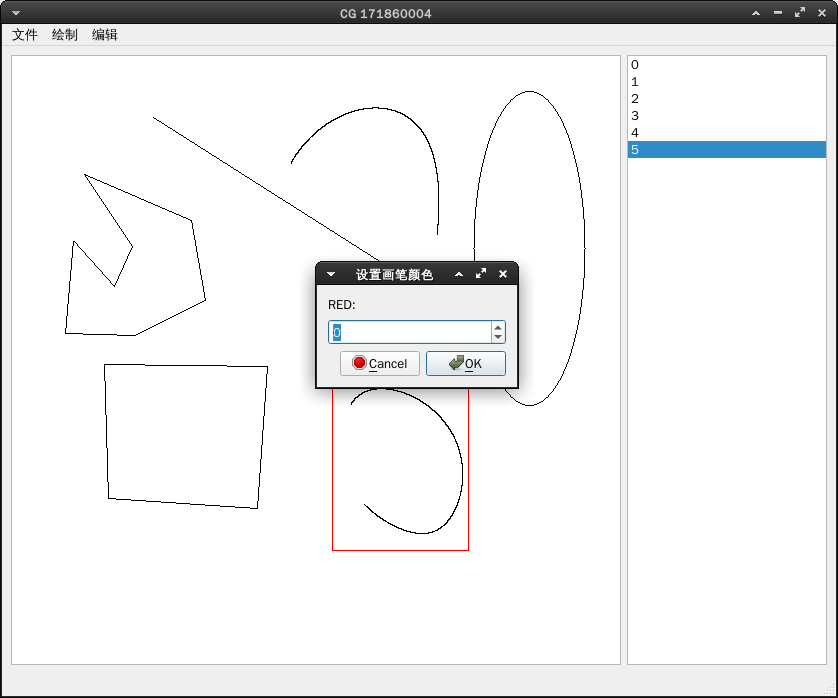

  输入 255 0 0以后再画椭圆的效果：

  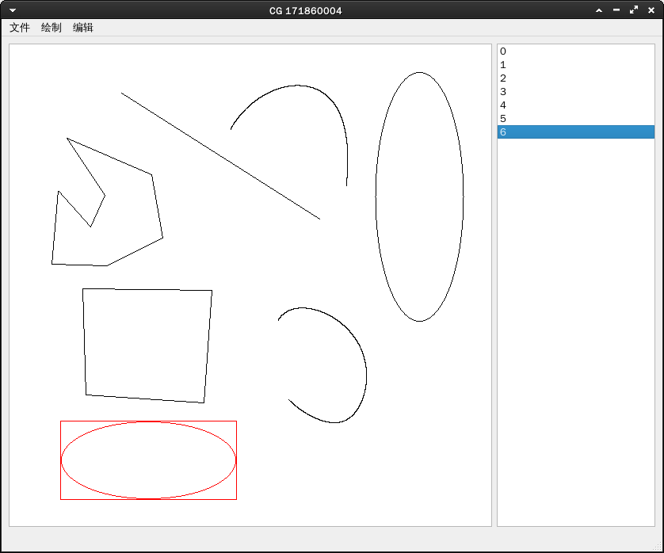

- 重置画布：

   点击重置画布，会连续跳出两个对话框要求你输入宽和高。以宽为例：

  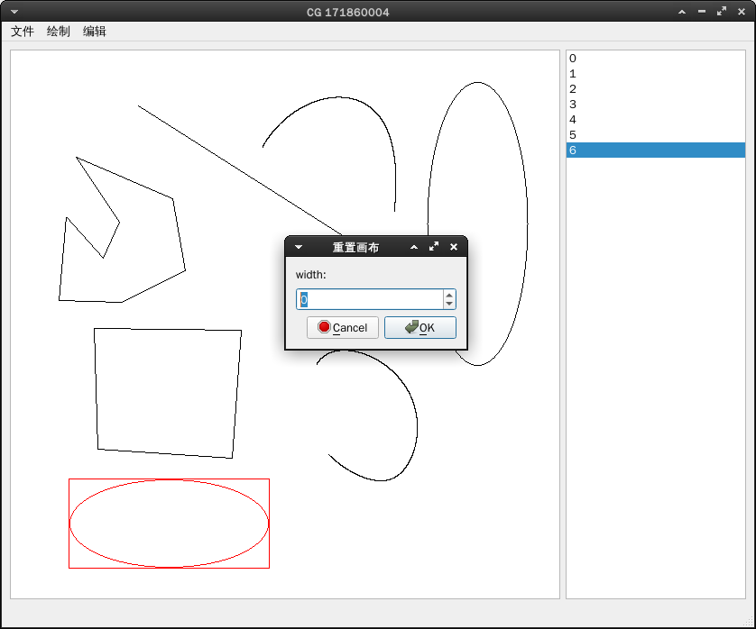

  输入500 500之后得到的效果：

  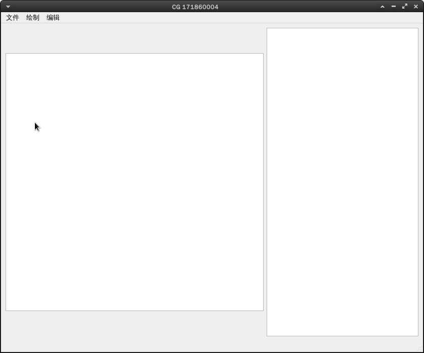

  注：这里要求输入100-1000的数字，如果输入数字小于100，会自动改为100；同理，输入数字大于1000，会自动改为1000。

- 保存画布：

  点击保存画布，会跳出一个对话框，要求你输入保存到文件的名字（name），然后图片会被保存到output/name.bmp中。如下：

  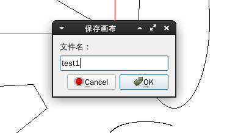

  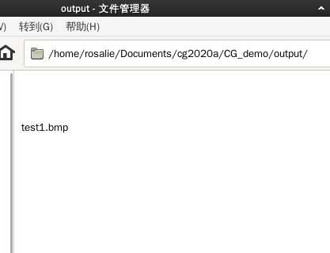

  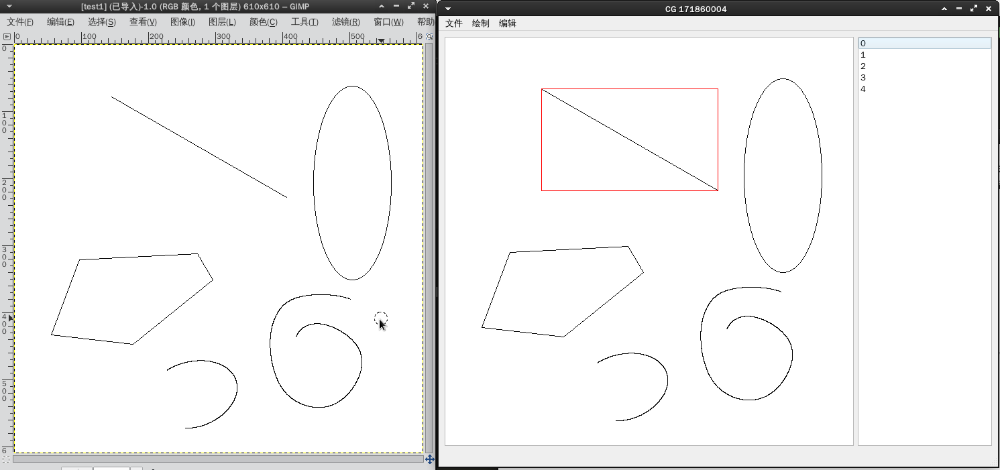

  注：上图左边为保存后打开的bmp位图，右边为系统界面。

- 退出：点击退出后退出系统。